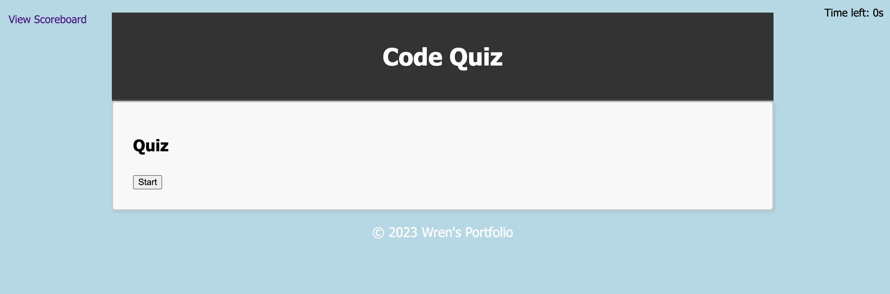

# Quiz-For-Rice-FromWren
## WHAT IS IN MY WEB?

```
GIVEN I am taking a code quiz
WHEN I click the start button
THEN a timer starts and I am presented with a question
WHEN I answer a question
THEN I am presented with another question
WHEN I answer a question incorrectly
THEN time is subtracted from the clock
WHEN all questions are answered or the timer reaches 0
THEN the game is over
WHEN the game is over
THEN I can save my initials and my score
```
```
In this challenge I created quiz to answer about some basic relate to HTML, in here I created 75 seconds countdown then if I answered wrong time will be minus when time reaches to zero, quiz will automatic to stop.
```
```
This is my deploy link:
https://nhunguyen-debug.github.io/Quiz-For-Rice-FromWren/
```
